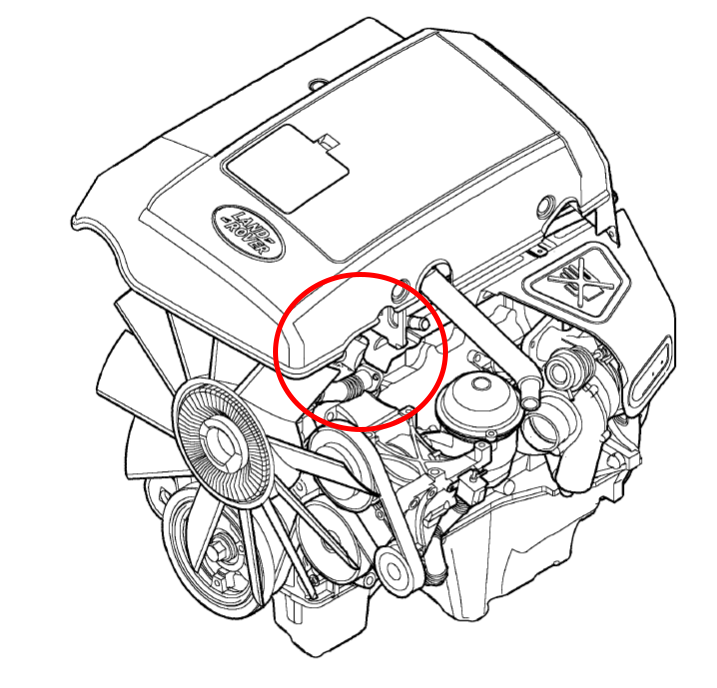
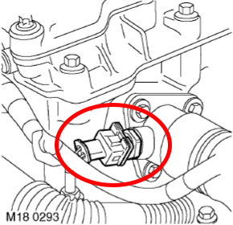

# Td5 Engine Coolant Temperature

## Introduction

The Engine Coolant Temperature (ECT) sensor provides the ECU with engine coolant temperature information.
The workshop manual (page 18-11) says that the ECU uses this information for the following functions:

+ Fuelling calculations,
+ Temperature gauge,
+ To limit engine operation if coolant temperature is to high,
+ Cooling fan operation,
+ Glow plug operating time.

## Location

The ECT sensor is located in the coolant outlet elbow on top of the engine.

## Operation

On the Td5 engine, the coolant temperature is displayed on a dashboard gauge.
However, the displayed value is not the "real" one : the ECU controls the gauge,
making it "sticky" to the 1/3 of the gauge to avoid showing the driver too much variations.
If the coolant is within the acceptable temperature range, it may vary in a 20 degrees range
without showing any movement on the dashboard gauge.

### Values range

From the user manual :

+ The coolant thermostat opens at around 82°C and will be fully open at around 96°C.
+ In cold ambient temperatures, the engine temperature is raised of about 10 degrees to compensate for the heat loss.

From values read on the dashboard gauge compared to the ones from the ECU :

+ The needle stays in the "blue" range while the coolant temperature is below 60°C,
+ The needle stabilizes at the 1/3 position when the coolant reaches ~72°C.

From informations found on the Internet :

+ At 110°C, ECU stats taking additional measures to assist cooling, then starts load shedding at 115°C,
+ At 120°C, ECU is in "Panic state", at which point the standard gauge is at max and the red light will be on.

## Application to the Android application

ECT is read from the ECU with a precision of 0.1°C.

Without further verified information, the following gauge sections will be set :

| Section name		| Min value	| Max value	| Color		|
|---            	|            ---|            ---|           --- |
| Cold 			| --°C 		| 60°C 		| Blue 		|
| Thermostat closed	| 60°C		| 82°C 		| Cyan 50%	|
| Thermostat regulation	| 82°C 		| 96°C 		| Green		|
| Thermostat opened	| 96°C 		| 110°C		| Yellow	|
| Load reduction	| 110°C		| 120°C 	| Orange	|
| Overheat		| 120°C		| --°C 		| Red		|

## References

+ https://workshop-manuals.com/landrover/defendertd5/cooling_system/general/
+ https://www.aulro.com/afvb/discovery-2-a/258904-nanocom-readings-post2773404.html#post2773404
+ https://www.aulro.com/afvb/discovery-2-a/190848-td5-water-temp-post2082004.html#post2082004